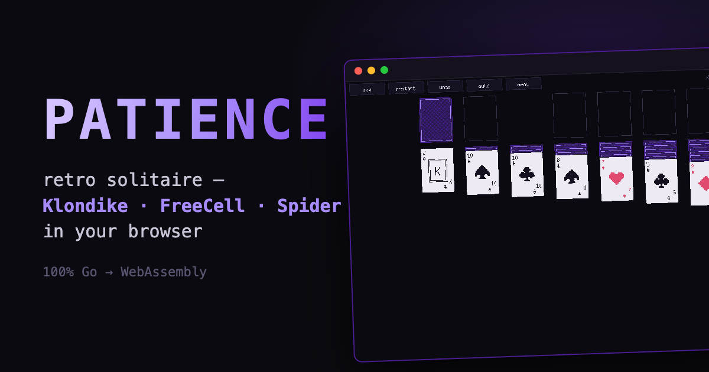

# patience

Retro solitaire in your browser — Klondike (draw 1/3), FreeCell, and Spider
(1/2/4 suits) on a chunky pixel-art deck, written entirely in Go and compiled
to WebAssembly.

**Play it: https://richardwooding.github.io/patience/play/**



## Features

- **Six configurations, three rule families** — Klondike draw-1 and draw-3,
  FreeCell with true supermove capacity (including the empty-column halving),
  and Spider at 1, 2, or 4 suits.
- **Pixel-art deck drawn in code** — 71×96 cards (the exact dimensions of
  Windows 3.0's CARDS.DLL), hand-drawn 16×16 suit pips, a purple lattice back.
  No image assets anywhere.
- **Unlimited undo** — every move snapshots the table, so undo walks back
  through stock recycles, flips, and Spider run removals to the original deal.
- **Safe auto-complete** — double-tap sends a card to its foundation; `A`
  finishes a won game using the classic safe-send rule so it never strands a
  card you still need.
- **The classic win cascade** — cards launch from the foundations, bounce, and
  leave trails.
- **Touch-first** — drag with mouse or finger; drop targeting uses card
  overlap, not the pointer, so it's forgiving on phones.
- **Per-variant stats** — games played, won, and best move count, persisted in
  localStorage (browser) or your user config dir (native).

## Keys

| Key | Action |
| --- | --- |
| drag | move a card or run |
| tap stock | deal / recycle |
| double-tap | send to foundation |
| `U` / `Cmd+Z` | undo |
| `H` | hint (flashes a useful move) |
| `A` | auto-finish |
| `N` | new deal |
| `R` | restart the same deal |
| `Esc` | menu |

Deep-link a variant with `?v=` — e.g.
[`play/?v=freecell`](https://richardwooding.github.io/patience/play/?v=freecell),
`?v=klondike-1`, `?v=klondike-3`, `?v=spider-1`, `?v=spider-2`, `?v=spider-4`.

## Run locally

```sh
go run .          # native window
go test ./...     # rules core is fully headless
```

Build the wasm bundle:

```sh
GOOS=js GOARCH=wasm go build -trimpath -ldflags="-s -w" -o docs/play/patience.wasm .
cp "$(go env GOROOT)/lib/wasm/wasm_exec.js" docs/play/
(cd docs/play && python3 -m http.server 8080)
```

## Architecture

`internal/solitaire` is a pure rules engine with zero rendering imports: a
card is one byte, each variant implements a small `Rules` interface over a
shared table of piles, and everything — deals, move legality, supermove
capacity, Spider's run-removal fixpoint, undo round-trips — is verified
headlessly in CI against seeded golden deals. `internal/ui` is the Ebitengine
front end; one codebase runs native and in the browser.

## License

[MIT](LICENSE)
